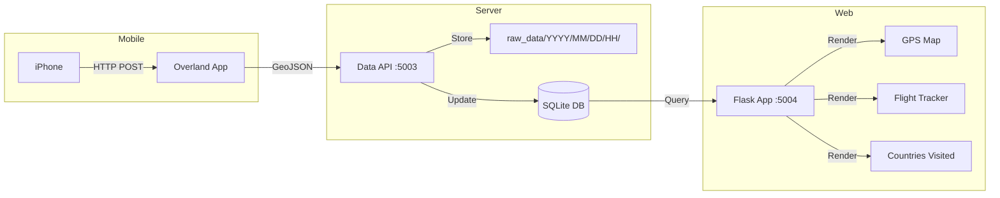

# Incognita

[](https://github.com/momonala/incognita/actions/workflows/ci.yml)
[](https://codecov.io/gh/momonala/incognita)

Personal GPS tracking and travel visualization system. Collects location data from iPhone Overland app and provides interactive dashboards for GPS tracking, flight history, and countries visited.

## Tech Stack

Python 3.12, Flask 3.x, SQLite, pandas, GeoPandas, PyDeck, Plotly

## Architecture



**Data flow:** iPhone → Overland App → HTTP POST → Data API → GeoJSON files + SQLite → Flask Web App → Interactive Maps

## Features

- **GPS Tracking**: Receive and store location data from Overland app
- **Interactive Maps**: Visualize GPS tracks with PyDeck/Deck.gl
- **Flight Tracking**: Analyze flight history with statistics and visualizations
- **Countries Visited**: Track and visualize countries visited with passport-style view
- **Heartbeat Monitoring**: Telegram alerts for server downtime
- **Data Organization**: Hierarchical file structure organized by date/hour

## Prerequisites

- Python 3.12+
- uv (Python package manager)
- iPhone with [Overland app](https://overland.p3k.io/) installed
- Telegram bot token (optional, for alerts)

## Installation

1. Clone and install dependencies:
   ```bash
   git clone <repository-url>
   cd incognita
   curl -LsSf https://astral.sh/uv/install.sh | sh
   uv sync
   ```

2. Configure `incognita/values.py`:
   ```python
   TELEGRAM_TOKEN = "your_telegram_bot_token"  # Optional
   TELEGRAM_CHAT_ID = "your_chat_id"           # Optional
   ```

3. Initialize the database:
   ```bash
   python -m incognita.scripts.refresh_db
   ```

## Running

### Data API Server (GPS Data Receiver)

Receives GPS data from Overland app:

```bash
python -m incognita.data_api
```

Server runs on port 5003. Configure Overland app to POST to:
- `http://your-server-ip:5003/dump` - Receive location data
- `http://your-server-ip:5003/heartbeat` - Heartbeat endpoint

### Web Dashboard

Main Flask application for viewing data:

```bash
python -m incognita.app
```

Open `http://localhost:5004`

Available routes:
- `/` - Home page
- `/gps` - GPS tracking map
- `/flights` - Flight history and statistics
- `/passport` - Countries visited visualization

## Project Structure

```
incognita/
├── incognita/
│   ├── app.py                  # Main Flask web app (port 5004)
│   ├── data_api.py             # GPS data receiver server (port 5003)
│   ├── database.py             # SQLite database operations
│   ├── processing.py            # GPS data processing (speed, distance)
│   ├── gps.py                  # GPS map generation
│   ├── flights.py              # Flight data processing
│   ├── countries.py            # Country tracking
│   ├── utils.py                # Utility functions
│   ├── values.py               # Configuration constants
│   └── scripts/
│       ├── refresh_db.py       # Rebuild database from raw files
│       ├── plot_recent.py      # Plot recent GPS data
│       └── generate_video.py   # Generate video from GPS tracks
├── raw_data/                   # Organized GeoJSON files
│   └── YYYY/MM/DD/HH/          # Hierarchical structure
├── templates/                  # Jinja2 templates
│   ├── index.html
│   ├── gps.html
│   ├── flights.html
│   └── passport.html
├── static/                     # Static assets
│   ├── app.js
│   └── styles.css
├── data/
│   └── geo_data.db            # SQLite database
```

## API Endpoints

### Data API Server (`:5003`)

| Endpoint | Method | Description |
|----------|--------|-------------|
| `/` | GET | Health check |
| `/status` | GET | Server status |
| `/dump` | POST | Receive GeoJSON location data from Overland app |
| `/heartbeat` | POST | Heartbeat endpoint for monitoring |
| `/coordinates` | GET | Fetch coordinates with filters |

### Web App (`:5004`)

| Endpoint | Method | Description |
|----------|--------|-------------|
| `/` | GET | Home page |
| `/gps` | GET/POST | GPS tracking map (date range selection) |
| `/flights` | GET | Flight history dashboard |
| `/passport` | GET | Countries visited visualization |

### `/coordinates`

Query params:
- `lookback_hours` - Number of hours to look back (default: 24)
- `min_accuracy` - Minimum horizontal accuracy in meters (default: 200)
- `max_distance` - Maximum distance between points in km (default: 0.1)

Response:
```json
{
  "status": "success",
  "count": 1234,
  "lookback_hours": 24,
  "min_accuracy": 200,
  "max_distance": 0.1,
  "coordinates": [
    ["2025-01-01T12:00:00Z", 52.5200, 13.4050, 15.5],
    ...
  ]
}
```

## Data Model

```
overland (table)
├── timestamp: TEXT (PK, ISO 8601 format)
├── lon: REAL (longitude)
├── lat: REAL (latitude)
├── speed: REAL (m/s, nullable)
├── altitude: REAL (meters, nullable)
├── horizontal_accuracy: REAL (meters)
├── motion: TEXT (nullable)
└── geojson_file: TEXT (source file path)
```

**Key constraints:**
- `timestamp` is the unique primary key (one row per timestamp)
- Data filtered by `horizontal_accuracy <= 200m` by default
- Files organized in `raw_data/YYYY/MM/DD/HH/` structure

## Data Organization

### File Structure

Raw GeoJSON files are organized hierarchically:
```
raw_data/
└── YYYY/
    └── MM/
        └── DD/
            └── HH/
                └── YYYYMMDD-HHMM00-{hash}.geojson
```

Files are named using:
- Date/time prefix: `YYYYMMDD-HHMM00`
- Content hash: Deterministic hash based on first/last timestamp + count
- Prevents duplicates: Same content = same filename

### Database Refresh

Rebuild database from raw files:
```bash
python -m incognita.scripts.refresh_db
```

This script:
- Processes all GeoJSON files in `raw_data/`
- Uses parallel processing for speed
- Creates SQLite database with WAL mode
- Filters by horizontal accuracy
- Creates timestamp index
- Runs VACUUM to optimize database

## Key Concepts

| Concept | Description |
|---------|-------------|
| `timestamp` | ISO 8601 timestamp (unique primary key) |
| `horizontal_accuracy` | GPS accuracy in meters (filtered at ≤200m) |
| `speed` | Calculated speed between GPS points |
| `motion` | Motion type from Overland (walking, driving, etc.) |
| Content hash | MD5 hash of first/last timestamp + count for deduplication |

## Storage

| Path | Purpose |
|------|---------|
| `raw_data/YYYY/MM/DD/HH/` | Organized GeoJSON files by date/hour |
| `data/geo_data.db` | SQLite database with all location data (tracked via Git LFS) |
| `.cache/` | Joblib function cache (not version controlled) |

## Background Jobs

Data API server includes watchdog thread:

| Schedule | Task |
|----------|------|
| Continuous | Monitor heartbeat endpoint |
| Escalating | Send Telegram alerts if no heartbeat (1m, 5m, 30m, 60m) |
| Recovery | Alert when heartbeat recovers |

## Development Commands

```bash
# Format code
black . && isort .

# Refresh database
python -m incognita.scripts.refresh_db

# Plot recent GPS data
python -m incognita.scripts.plot_recent
```

## Deployment

### Systemd Services

Service files in `install/` directory:

- `projects_data-api.service` - Data API server (port 5003)
- `projects_incognita_dashboard.service` - Web dashboard (port 5004)
- `projects_incognita_data-backup-scheduler.service` - Git backup scheduler

```bash
sudo cp install/*.service /etc/systemd/system/
sudo systemctl enable projects_data-api.service
sudo systemctl enable projects_incognita_dashboard.service
sudo systemctl enable projects_incognita_data-backup-scheduler.service
sudo systemctl start projects_data-api.service
sudo systemctl start projects_incognita_dashboard.service
sudo systemctl start projects_incognita-data-backup-scheduler.service
```

### Overland App Configuration

Configure Overland app to POST to your server:
- **URL**: `http://your-server-ip:5003/dump`
- **Method**: POST
- **Format**: GeoJSON

## Known Limitations

- Timestamp is unique - duplicate timestamps are filtered out
- Files with missing `horizontal_accuracy` are skipped
- Database uses WAL mode for concurrent writes
- No authentication on API endpoints
- Heartbeat alerts disabled between 11pm-7am
