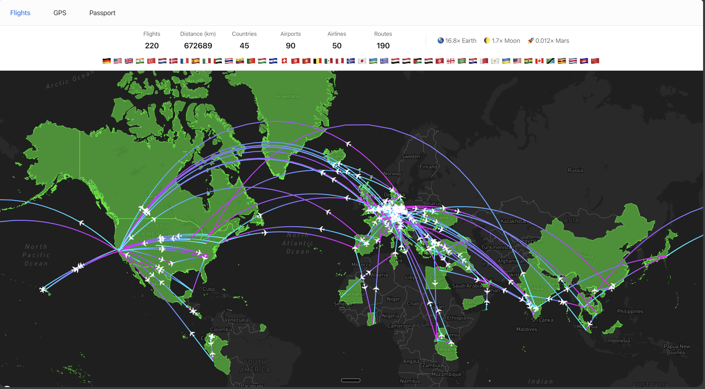
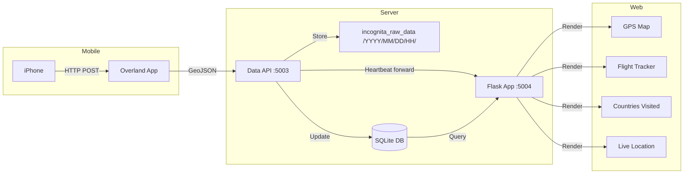

# Incognita

[](https://github.com/momonala/incognita/actions/workflows/ci.yml)
[](https://codecov.io/gh/momonala/incognita)

Personal GPS tracking and travel visualization system. Collects location data from a GPS app ([Trace](https://github.com/momonala/Trace) or [Overland](https://github.com/aaronpk/Overland-iOS)) and provides interactive dashboards for GPS tracking, flight history, and countries visited.

## Screenshots


*GPS trip tracks for a date range, visualized on a satellite map*


*Global flight history with animated routes and travel statistics*

## Tech Stack

Python 3.12, Flask 3.x, SQLite, pandas, GeoPandas, PyDeck, Plotly

## Architecture


```mermaid
flowchart LR
    subgraph Mobile
        iPhone[iPhone] -->|HTTP POST| Overland[Overland App]
    end
    subgraph Server
        Overland -->|GeoJSON| DataAPI[Data API :5003]
        DataAPI -->|Store| Files[incognita_raw_data /YYYY/MM/DD/HH/]
        DataAPI -->|Update| DB[(SQLite DB)]
        DataAPI -->|Heartbeat forward| WebApp
    end
    subgraph Web
        DB -->|Query| WebApp[Flask App :5004]
        WebApp -->|Render| GPS[GPS Map]
        WebApp -->|Render| Flights[Flight Tracker]
        WebApp -->|Render| Passport[Countries Visited]
        WebApp -->|Render| Live[Live Location]
    end
```

**Data flow:** iPhone → Overland App → HTTP POST → Data API → GeoJSON files + SQLite → Flask Web App → Interactive Maps

## Features

- **GPS Tracking**: Receive and store location data from Overland app
- **Interactive Maps**: Visualize GPS tracks with PyDeck/Deck.gl; date ranges of one week or less play an animated comet-trace of the path (the same effect as the Live page), longer ranges show a static satellite map
- **Live Location**: Real-time map showing most recent GPS fix with animated day-path replay; staleness dot uses the fresher of the last GPS fix or last heartbeat, so the indicator stays green while stationary
- **Flight Tracking**: Analyze flight history with statistics and visualizations
- **Countries Visited**: Track and visualize countries visited with passport-style view
- **Heartbeat Monitoring**: Telegram alerts for data streaming downtime, with escalating backoff (1m → 5m → 30m → 1h). Alerts are muted during overnight quiet hours (11pm–7am) and during an active snooze window (set via `/snooze` from the Trace app when the phone is intentionally offline)
- **Daily Motion Stats**: Per-day distance, speed, altitude gain/loss, and time by motion type from the GPS database

## Prerequisites

- Python 3.12+
- uv (Python package manager)
- phone with Trace or Overland installed for GPS dumps
- Telegram bot token (optional, for alerts)
- [spyglass](https://github.com/momonala/spyglass) server running locally (optional, for metrics — `cd ../spyglass && uv run spyglass serve`)

## Installation

1. Clone and install dependencies:
   ```bash
   git clone <repository-url>
   cd incognita
   curl -LsSf https://astral.sh/uv/install.sh | sh
   uv sync
   ```

2. Configure `incognita/values.py`:
   ```python
   MAPBOX_API_KEY = "your_mapbox_token"              # Required for maps
   GOOGLE_MAPS_API_KEY = "your_google_maps_key"      # Optional (some views)
   TELEGRAM_TOKEN = "your_telegram_bot_token"        # Optional (heartbeat alerts)
   TELEGRAM_CHAT_ID = "your_chat_id"                 # Optional (heartbeat alerts)
   ```

3. Initialize the database:
   ```bash
   uv run refresh-db
   # or: python -m incognita.scripts.refresh_db
   ```

## Running

### Data API Server (GPS Data Receiver)

Receives GPS data from Overland app:

```bash
uv run data-api
# or: python -m incognita.data_api
```

Server runs on port 5003. Configure Overland app to POST to:
- `http://your-server-ip:5003/dump` - Receive location data
- `http://your-server-ip:5003/heartbeat` - Heartbeat endpoint

### Web Dashboard

Main Flask application for viewing data:

```bash
uv run app
# or: python -m incognita.app
```

Open `http://localhost:5004`

Available routes:
- `/` - Home page
- `/gps` - GPS tracking map
- `/flights` - Flight history and statistics
- `/passport` - Countries visited visualization
- `/live` - Live location with animated day-path replay

## Project Structure

```bash
incognita/
├── incognita/
│   ├── app.py                  # Main Flask web app (port 5004)
│   ├── data_api.py             # GPS data receiver server (port 5003)
│   ├── database.py             # SQLite ingest and GeoJSON parsing
│   ├── motion_stats.py         # Daily motion stats from geo_data.db
│   ├── gps_geometry.py         # Haversine distance and segment metrics on point series
│   ├── gps_trips_renderer.py   # Raw GPS trips (load, segment, simplify) + PyDeck map HTML
│   ├── flights.py              # Flight data processing
│   ├── countries.py            # Country tracking
│   ├── utils.py                # Utility functions
│   ├── values.py               # Configuration constants
│   └── scripts/
│       ├── refresh_db.py       # Rebuild database from raw files
│       ├── health_step_duplicates.py  # Find days with step data from multiple hardware versions
│       └── generate_video.py   # Generate video from GPS tracks
├── ../incognita_raw_data/                # Organized GeoJSON files (sibling to repo)
│   └── YYYY/MM/DD/HH/          # Hierarchical structure
├── templates/                  # Jinja2 templates
│   ├── index.html
│   ├── gps.html
│   ├── flights.html
│   └── passport.html
├── static/                     # Static assets
│   ├── trips_trace.js          # Shared deck.gl comet-trace animation (live + gps pages)
│   ├── table_utils.js
│   └── styles.css
├── data/
│   └── geo_data.db            # SQLite database
```

## API Endpoints

### Data API Server (`:5003`)

| Endpoint | Method | Description |
|----------|--------|-------------|
| `/` | GET | Health check |
| `/status` | GET | Server status |
| `/dump` | POST | Receive GeoJSON location data from Overland app |
| `/heartbeat` | POST | Heartbeat endpoint for monitoring; forwards to web app |
| `/snooze` | POST | Mute downtime alerts for `{"hours": 1–24}` (phone intentionally offline) |
| `/ios-dump` | POST | Receive HealthKit sample batches from the iOS export app |
| `/health-data` | GET | Daily HealthKit summary (steps, distance, energy, flights climbed) |
| `/motion-stats` | GET | Daily GPS motion summary from SQLite (distance, speed, altitude, by motion type) |
| `/coordinates` | GET | Fetch simplified coordinates from raw GPS files |
| `/observability` | GET | Redirect to the Spyglass-hosted observability dashboard |

### Web App (`:5004`)

| Endpoint | Method | Description |
|----------|--------|-------------|
| `/` | GET | Home page |
| `/gps` | GET/POST | GPS tracking map (date range selection); ranges ≤7 days render an animated comet-trace, longer ranges a static map |
| `/flights` | GET | Flight history dashboard |
| `/passport` | GET | Countries visited visualization |
| `/live` | GET | Live location map with animated day-path replay |
| `/live/current` | GET | JSON snapshot of current location, GPS fix time, and last heartbeat time |
| `/internal/heartbeat` | POST | Internal endpoint; receives forwarded heartbeat from data API to update last-seen time |
| `/observability` | GET | Redirect to the Spyglass-hosted observability dashboard |

### `/coordinates`

Query params:
- `lookback_hours` - Number of hours to look back (default: 24)

Response:
```json
{
  "status": "success",
  "count": 1234,
  "lookback_hours": 24,
  "paths": [
    [
      {
        "timestamp": "2025-01-01T12:00:00Z",
        "latitude": 52.5200,
        "longitude": 13.4050
      }
    ],
    ...
  ]
}
```

### `/motion-stats`

Daily GPS activity from `geo_data.db` for the full calendar day. Moving distance, speed, and per-motion breakdowns use rows with `speed > 0`; `motion_type.stationary` reports time only (distance is always 0). Distance and time use haversine segments between consecutive readings; altitude gain/loss uses moving rows only; speeds use per-row Overland values (m/s).

Query params:
- `date` - Calendar day as `YYYY-MM-DD`, or `today` (default: today in local time)

Response:
```json
{
  "date": "2025-01-01",
  "total_km": 12.5,
  "max_speed_m_s": 20.0,
  "avg_speed_m_s": 5.0,
  "time_spent_seconds": 3600.0,
  "altitude_ascended_m": 150.0,
  "altitude_descended_m": 75.0,
  "motion_type": {
    "automotive": { "distance_km": 6.5, "time_seconds": 3000.0 },
    "cycling": { "distance_km": 3.0, "time_seconds": 300.0 },
    "running": { "distance_km": 1.5, "time_seconds": 150.0 },
    "stationary": { "distance_km": 0.0, "time_seconds": 900.0 },
    "unknown": { "distance_km": 1.0, "time_seconds": 100.0 },
    "walking": { "distance_km": 2.0, "time_seconds": 200.0 }
  }
}
```

`motion_type` keys: `automotive`, `cycling`, `running`, `stationary`, `unknown`, `walking`. Only rows with `speed > 0` contribute distance and moving time; `stationary` time is summed from rows labeled `stationary` on the full-day timeline.

## Data Model

```
overland (table)
├── timestamp: TEXT (PK, ISO 8601 format)
├── lon: REAL (longitude)
├── lat: REAL (latitude)
├── speed: REAL (m/s, nullable)
├── altitude: REAL (meters, nullable)
├── horizontal_accuracy: REAL (meters)
├── motion: TEXT (nullable)
└── geojson_file: TEXT (source file path)
```

**Key constraints:**
- `timestamp` is the unique primary key (one row per timestamp)
- Data filtered by `horizontal_accuracy <= 200m` by default
- Files organized in `incognita_raw_data/YYYY/MM/DD/HH/` structure

## Data Organization

### File Structure

Raw GeoJSON files are organized hierarchically (by default stored in a `incognita_raw_data/` directory
adjacent to this repository, e.g. `../incognita_raw_data` when running commands from the project root):
```
incognita_raw_data/
└── YYYY/
    └── MM/
        └── DD/
            └── HH/
                └── YYYYMMDD-HHMM00-{hash}.geojson
```

Files are named using:
- Date/time prefix: `YYYYMMDD-HHMM00`
- Content hash: Deterministic hash based on first/last timestamp + count
- Prevents duplicates: Same content = same filename

### Database Refresh

Rebuild database from raw files:
```bash
uv run refresh-db
# or: python -m incognita.scripts.refresh```

This script:
- Processes all GeoJSON files in `incognita_raw_data/`
- Uses parallel processing for speed
- Creates SQLite database with WAL mode
- Filters by horizontal accuracy
- Creates timestamp index
- Runs VACUUM to optimize database

## Key Concepts

| Concept | Description |
|---------|-------------|
| `timestamp` | ISO 8601 timestamp (unique primary key) |
| `horizontal_accuracy` | GPS accuracy in meters (filtered at ≤200m) |
| `speed` | Speed from Overland (m/s, nullable) |
| `motion` | Motion type from Overland (`stationary`, `walking`, `cycling`, `automotive`, etc.) |
| Motion categories | `/motion-stats` reports `automotive`, `cycling`, `running`, `stationary`, `unknown`, `walking` |
| Content hash | MD5 hash of first/last timestamp + count for deduplication |

## Storage

| Path | Purpose |
|------|---------|
| `../incognita_raw_data/YYYY/MM/DD/HH/` | Organized GeoJSON files by date/hour |
| `data/geo_data.db` | SQLite database with all location data (tracked via Git LFS) |
| `.cache/` | Joblib function cache (not version controlled) |

## Background Jobs

Data API server includes two background threads:

| Schedule | Task |
|----------|------|
| Continuous | Monitor heartbeat endpoint (watchdog) |
| Escalating | Send Telegram alerts if no heartbeat (1m, 5m, 30m, 60m) |
| Recovery | Reset backoff to 1m when the heartbeat returns (no message sent) |
| Muting | Suppress alerts during quiet hours (11pm–7am) or an active `/snooze` window |
| Hourly | Report raw-data file count, total DB size, process RSS and GC object count to spyglass (`metrics_scheduler`, via the `schedule` library) |

## Observability

Both Flask servers report metrics to [spyglass](https://github.com/momonala/spyglass) under project `incognita` (`SPYGLASS_HOST` / `SPYGLASS_DASHBOARD_URL` in `pyproject.toml [tool.config]`). Metrics degrade silently if no spyglass server is reachable.

| Metric | Where | What it tracks |
|--------|-------|----------------|
| `<func>.duration_ms`, `<func>.mem_delta_mb` | `incognita.observability.timed` | Wall time and RSS memory delta for expensive functions (`gps_df_to_deck_map`, `_get_month_trips_cached_impl`, `get_trip_points_for_date_range`, `get_trips_for_date_range`) |
| `update_db.success` / `update_db.error` (tagged `kind`) | `database.update_db` | GPS ingest-to-SQLite success rate, both live `/dump` writes and bulk `refresh-db` runs |
| `dump.files_received`, `dump.locations_count`, `dump.wrote_file`, `dump.duplicate_skipped` | `data_api.dump` | Count of GeoJSON files received from Overland and whether each was new or a duplicate |
| `ios_dump.batches_received`, `ios_dump.validation_error` | `data_api.ios_dump` | Count of HealthKit batches received and schema-validation failures |
| `insert_health_batch.samples_received`, `.inserted`, `.skipped`, `.success` / `.error` | `health_database.insert_health_batch` | HealthKit sample ingest-to-SQLite success rate |
| `api.<endpoint>.latency_ms` | both apps' `before_request`/`after_request` hooks | Per-route request latency |
| `report_storage_metrics.raw_data_file_count`, `.db_size_mb` | `data_api.report_storage_metrics` | File count under `incognita_raw_data/` and combined size (MB) of `geo_data.db` + `health_data.db` (with WAL/SHM sidecars); reported hourly |
| `report_process_metrics.rss_mb`, `.gc_objects` | `data_api.report_process_metrics` | Process resident set (MB) and GC-tracked object count, reported hourly. Only meaningful read together: both climbing means real object retention, `rss_mb` climbing alone means allocator fragmentation |

Visit `/observability` on either server to open the spyglass dashboard.

## Development Commands

```bash
# Format code
black . && isort .

# Refresh database
uv run refresh-db
# or: python -m incognita.scripts.refresh_db

# Find days with step data from multiple hardware versions
uv run health
# or: python -m incognita.scripts.health_step_duplicates
```

## Deployment

### Systemd Services

Service files in `install/` directory:

- `projects_data-api.service` - Data API server (port 5003)
- `projects_incognita.service` - Web app (port 5004)
- `projects_incognita_data-backup-scheduler.service` - Git backup scheduler

```bash
sudo cp install/*.service /etc/systemd/system/
sudo systemctl enable projects_data-api.service
sudo systemctl enable projects_incognita.service
sudo systemctl enable projects_incognita_data-backup-scheduler.service
sudo systemctl start projects_data-api.service
sudo systemctl start projects_incognita.service
sudo systemctl start projects_incognita-data-backup-scheduler.service
```

### Overland App Configuration

Configure Overland app to POST to your server:
- **URL**: `http://your-server-ip:5003/dump`
- **Method**: POST
- **Format**: GeoJSON

## Known Limitations

- Timestamp is unique - duplicate timestamps are filtered out
- Files with missing `horizontal_accuracy` are skipped
- Database uses WAL mode for concurrent writes
- No authentication on API endpoints
- Heartbeat alerts muted between 11pm–7am and during an active `/snooze` window
